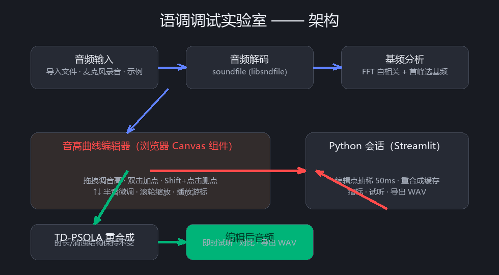

# 🎵 语调调试实验室（Intonation Debug Lab）

一个用于**语调（音高）调试**的交互式工具：

- 📁 **导入音频**（wav / mp3 / flac / ogg）或 🎙️ **麦克风录音**，也内置一段**示例哼鸣**
- 📈 自动提取并显示**音高（F0）曲线**（对数/半音刻度，附波形）
- 🖱️ 鼠标**拖拽**调节音高 + ⌨️ 快捷键（`A` 加点、`Delete` 删点、`↑↓` 半音微调、滚轮缩放）
- 📝 **音节标注**：图下音节轨手动标注（连续框、共享边界联动、双击分割、拖拽移动/新建），或 **🧩 自动切分音节**（浊音段 + 能量包络，连续铺满无空隙）
- 🔤 **音节文本自动对齐**：工具行文本框输入整段文本（**汉字**每字一音节可带声调数字；**拼音**按声调数字 0-5 切分，如 `wo3men0shi4yi1shi4ba0` = 6 音节），一键按顺序填入音节框
- 📏 **音节边界分段显示**：边界处画与波形同色的竖线把波形分段，随边界拖动实时更新
- 🎵 **按声调提取特征点**：根据音节声调（如 `liu4`）自动提取最高点/最低点，删除其间平滑过渡点
- 🎯 **特征点提取（仿 Praat Stylize）**：按变化趋势压缩曲线为少量特征点，便于手动调整语调
- 🎶 用修改后的音高曲线**重合成音频**，即时试听、对比、导出 WAV



---

## 快速开始

### 方式一：一键启动（推荐）

双击项目根目录下的 **`一键启动.bat`** 即可：

- 自动定位并实际验证 Python 3.10+（支持项目 `.venv`、`python` 和 Windows `py -3`；失效的虚拟环境会被跳过）
- 首次运行自动安装依赖（`requirements.txt`）
- 检查 8507 端口；若被占用则报告 PID，不会误杀其他程序
- 启动服务并自动打开浏览器 `http://localhost:8507`

> 若页面仍是旧版本：先关闭占用 8507 端口的旧服务，再重新启动并按 `Ctrl+F5`。

### 方式二：命令行

```bash
# 建议使用虚拟环境
python -m venv .venv
.venv\Scripts\activate          # Windows
# source .venv/bin/activate     # Linux / macOS

pip install -r requirements.txt
streamlit run app.py --server.port=8507
```

浏览器打开 `http://localhost:8507`（与「一键启动」相同；省略 `--server.port` 时 Streamlit 默认是 8501）。

---

## 使用方法

1. 在左侧选择音频来源：**导入文件** / **麦克风录音** / **示例音频**
   （左侧功能区均为**折叠式**，按需展开相应分组，节省空间）；
2. 稍候自动完成基频分析，主区显示波形 + 音高曲线；
3. 在曲线上操作：
   | 操作 | 效果 |
   |---|---|
   | 拖拽圆点手柄 | 上下调节该时刻音高（可左右微调时间） |
   | `A` / `Insert` 键（先点击图内）或双击 | 在鼠标位置插入新的音高控制点 |
   | `Shift` + 点击圆点 / `Delete` 键 | 删除控制点 |
   | `↑` / `↓` | 选中点按 1 半音微调（`PageUp/PageDown` = 5 半音） |
   | 鼠标滚轮 | 缩放时间轴；`Shift` + 滚轮平移时间；`Ctrl` + 滚轮缩放音高刻度 |
   | ▶ 播放按钮 | 试听原始/编辑后音频，并显示播放游标 |
4. **📝 音节标注（图下方音节轨）**：
   - 点击图上 **📝 标注音节** 开启标注模式（模式持久化，操作/刷新后保持）；
   - **🧩 自动切分音节** 生成的音节框**连续铺满**整条时间轴（两两之间无空隙，
     首尾贴 [0, 时长]），段间边界取停顿处能量最低的自然切分点；
   - 拖拽音节框**左右边缘**微调边界：相邻两框共享该边界，**同时联动**保持连续；
     拖拽**框体**整体移动（相邻框边界跟随）；**双击**框内任意处**一分为二**；
     在空白处拖拽新建音节框；
   - 右侧输入框填音节文本（如 `liu4`，末尾数字 = 声调）；**Delete** 删除当前选中的音节或层项（不必处于标注模式）；
5. 使用左侧面板做整体处理：
   - **音高编辑操作**：**升/降 1 半音**、**平滑曲线**；
   - **🎯 特征点（仿 Praat Stylize）**：按音高变化趋势提取**特征点**（转折点/端点），
     去除中间连续性好的点，再拖拽特征点微调语调 —— 对应 Praat 的
     `To PitchTier... stylize`；**容差（半音）** 越大保留点越少；
   - **🎵 按声调提取特征点**：对每个标注音节按声调自动提取特征点并删除其间的
     平滑过渡点（**1 声**·稳定段两端；**2 声**·前半段低点+后半段高点；
     **3 声**·两端+低点；**4 声**·前半段高点+后半段低点；
     无数字=自动按轮廓推断声调后套用）；
6. 图表上方的**工具行**（单行，图表独占整宽）：
   - **↩️ 撤销 / ↪️ 恢复 / 🔄 重置为原始曲线**（窄按钮，可多次点击逐级撤销/恢复；
     拖拽、加点、音节调整、升降调、提取特征点、自动切分等**全部计入历史**）；
   - **🔤 音节文本对齐**：文本输入框在工具行右侧 —— 输入整段文本点 **对齐**，
     **汉字**每字一音节（可带声调数字如 `好3`）；**拼音**以声调数字 **0-5** 切分
     （如 `wo3men0shi4yi1shi4ba0` = 6 个），空格/标点自动忽略；
     数量与音节框一致才应用（可撤销），不一致时提示；
   - 音节边界产生后，主图上会在每个边界处画**与波形同色的竖线**把波形分段，
     拖动边界时竖线实时跟随；
7. **💾 保存结果**：可**📦 一键保存全部**（ZIP：解码后原始+编辑后 WAV+多层 TextGrid）或分别下载；TextGrid 为 Praat 直接可读（UTF-8 无 BOM，点层为标准 `TextTier`，区间层自动连续铺满）。
8. 试听对比区可播放解码后原始 / 编辑后的音频（多声道输入会先下混为单声道）。

---

## 工作原理

```
音频字节 ──► soundfile 解码 ──► 基频分析（归一化自相关，分块 FFT）
                                  │
                                  └─► F0 音高曲线（对数/半音刻度，可拖拽编辑）
编辑后的 F0 曲线 ──► TD-PSOLA 重合成 ──► 编辑后音频（时长不变、清浊结构保持）
```

- **基频提取**：归一化自相关法（去均值分帧 → 分块 FFT 自相关 → 首峰规则选基频 → 抛物线插值 →
  时间域中值滤波），纯 NumPy 实现，无原生依赖。
- **重合成**：TD-PSOLA（时域基音同步叠加）。按原始基频在浊音段定位基音标记，
  以“编辑后基频”决定输出窗间距，窗内信号取自源波形，叠加后按窗和归一化；
  清音段直接拷贝原信号。时长、音色与清浊结构基本保持不变。
- **特征点提取（仿 Praat Stylize）**：半音域 RDP 折线简化 + 显著转折点保留 +
  最小间隔去冗余，按浊音段独立处理；把密集曲线压缩为少量趋势特征点
  （示例音频 57 点 → 5 点），偏差不超过设定容差（半音）。
- **自动音节切分**：浊音段（F0>0）为音节核，边界按 RMS 能量包络向两侧扩展，
  超长浊音段在能量谷处拆分，并**连续铺满**整条时间轴（段间边界取间隙内
  RMS 最低处，保证无空隙）；**按声调提取特征点**按声调保留特征点
  （1 声两端 / 2 声前半低点+后半高点 / 3 声两端+低点 / 4 声前半高点+后半低点），
  删除其间的平滑过渡点。
- **编辑交互**：Streamlit 自定义组件（纯原生 JS + Canvas，无构建步骤），
  通过 Streamlit Components v1 的 `postMessage` 协议与 Python 双向通信；固定组件标识，
  编辑重跑时保留前端视图状态。
- 编辑点抽稀到约 50ms 一个控制点，拖拽后按分析帧移（默认 10ms）在半音域线性插值回 F0 网格。

## 项目结构

```
intonation-lab/
├── app.py                        # Streamlit 主应用
├── core.py                       # 音频加载 / 基频分析 / TD-PSOLA 重合成
├── i18n.py                       # 中/英文案
├── requirements.txt
├── 一键启动.bat                  # Windows：依赖检查 + 端口 8507
├── pitch_editor/
│   ├── __init__.py               # 组件声明（st.components.v1）
│   └── frontend/
│       ├── index.html            # 组件外壳（工具栏 + 画布）
│       └── component.js          # Canvas 音高曲线绘制 + 拖拽交互
├── tests/
│   ├── test_core.py              # TextGrid / 音高 / 切分 / 声调回归
│   └── test_app.py               # Streamlit 空页与 demo 冒烟
├── docs/                         # 架构示意图
└── README.md
```

## 回归测试

```bash
python -m unittest discover -s tests -v
```

测试覆盖 TextGrid 长/短格式、标准 `TextTier`、旧 `PointTier` 导入兼容、UTF-16、
引号转义、时间不变量、半音插值、F0 裁剪、分块分析、特征点保留、
拼音/汉字切分、自动音节切分、声调特征点规则，以及组件音频内嵌策略。

## 已知限制

- 支持 `wav / mp3 / flac / ogg`；具体压缩编码能否读取取决于安装包中的 libsndfile。
- 去声/儿化等**衰减尾段**可能抽不出 F0：把最后一个控制点拖到更晚，或在空白处双击加点。原波形没有脉冲时，重合成会沿用最后一周期或按目标 F0 补谐波，加点才能听见。也可把「基频下限」降到 40–60 Hz。
- TD-PSOLA 重合成对**极高/极低基频**（超出分析上下限）不适用；调整侧边栏“基频上下限”可覆盖更多情况。
- 修改“分析参数”（基频上下限、帧移）会重新提取音高并**重置**当前编辑。
- 超长音频（>4 分钟）重合成耗时与内存上升，请耐心等待或截取片段。
- 图表内播放只嵌入较小 WAV（约 1.5MB / 约 47s·16kHz 单声道）；更大的音频请用主区「试听对比」。
